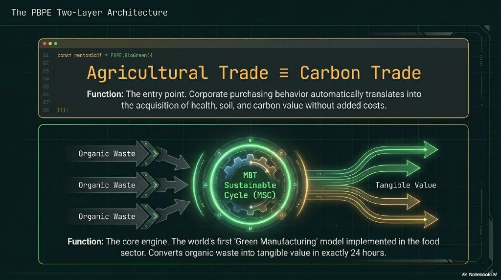

<!-- Header Image -->
<p align="center">
  
</p>

# 📘 **MBT‑Biosecurity‑Engine**
### _Planetary Biosecurity × Regenerative Agriculture × Climate Intelligence_

---

# 🏢 **Live Dashboard**

Explore the real-time PBPE ecosystem through our interactive dashboards.  
Each dashboard represents a different layer of the PBPE Hypercycle — connecting food, soil, health, climate, and finance into one unified operating system.

### 🌍 MBT‑Biosecurity‑Engine – Investor Scenario Explorer  
Biosecurity × Soil Health × Climate Resilience × PBPE Credits  
https://mbt-biosecurity-engine-bejnrfugexkataudf9aqwh.streamlit.app/

### 🪴 PBPE Planetary Dashboard  
Plant-Based Planet Economy – Unified Food & Climate OS  
https://shimojok.github.io/PBPE-Dashboard/

---

# 📄 **PBPE Core Model Slide Decks**

The conceptual foundation of this engine is documented in the PBPE Core Model slide decks.

### **English Version**
`./docs/slides/The_PBPE_Core_Model_en.pdf`

### **Japanese Version**
`./docs/slides/The_PBPE_Core_Model_jp.pdf`

These slides explain:

- PBPE Two‑Layer Architecture  
- MSC (MBT Sustainable Cycle)  
- 5 Value Conversion Engines  
- Hypercycle mechanics  
- Structural solutions to food, climate, and health crises  
- Agricultural trade = carbon trade  
- Organic waste → value in 24 hours (MBT55)  

---

# 🌍 **1. Introduction**  
_(Preserved from your original README)_

**MBT‑Biosecurity‑Engine** is the scientific computation layer of the  
**Planetary Bio‑Positive Economy (PBPE)**.

It transforms **MBT55/HMT238 microbial biosecurity effects** into:

- Quantifiable biological KPIs  
- Soil carbon and GHG metrics  
- Food loss reduction  
- Livestock One‑Health improvements  
- Economic value (PBPE‑Biosecurity Credits)  
- Climate finance assets  

This repository provides:

- **Mathematical models** of ecological hypercycles  
- **Disease, soil, livestock, climate simulations**  
- **Unified data schema** for AGRIX → MBT55 → PBPE  
- **Interactive dashboard prototype**  
- **Documentation for PBPE integration**

MBT‑Biosecurity‑Engine is not a static document collection.  
It is a **living computational engine** that powers PBPE’s global climate‑agriculture system.

---

# 🧬 **2. Core Concept**  
_(Preserved from your original README)_

MBT55/HMT238 activates **ecological hypercycles**:

- Microbial biomass ↑  
- Nutrient cycling ↑  
- Plant productivity ↑  
- Soil carbon stabilization ↑  
- GHG emissions ↓  
- Disease pressure ↓  
- Food loss ↓  
- Livestock health ↑  

This engine converts **biological regeneration** into **economic and climate value**.

---

# 🧱 **3. Repository Structure**  
_(Preserved exactly as in your original README)_

```
MBT-Biosecurity-Engine/
│
├── 00_Overview/
│     └── README.md
│
├── 01_Biosecurity_Fundamentals/
├── 02_MBT55_Mechanisms/
├── 03_Disease_Matrix/
├── 04_Livestock_Biosecurity/
├── 05_PostHarvest/
├── 06_Soil_Climate/
├── 07_PBPE_Link/
│
├── 08_Dashboard/
│     ├── Dashboard_Design.md
│     ├── Indicators_List.md
│     ├── Data_Model.json
│     ├── Streamlit_Prototype.py
│     └── PBPE_Visualization_Spec.md
│
├── 09_Code_Models/
│     ├── Disease_Risk_Model.py
│     ├── Microbial_Simulation.py
│     ├── Soil_Carbon_Model.py
│     ├── Price_Stability_Model.py
│     └── OneHealth_Model.py
│
└── Appendix/
      ├── MBT55_Microbial_List.md
      ├── Scientific_Papers.md
      ├── Field_Data.md
      ├── Biosecurity_Glossary.md
      └── FAQ.md
```

---

# 🧠 **4. Architecture Overview**  
_(Preserved from your original README)_

### _Scientific Engine → Data Layer → Dashboard → PBPE Integration_

```
                 ┌──────────────────────────────────────────┐
                 │        MBT‑Biosecurity‑Engine            │
                 │      (Scientific Computation Layer)      │
                 └──────────────────────────────────────────┘
                                 │
                                 ▼
     ┌────────────────────────────────────────────────────────────────┐
     │                        09_Code_Models/                         │
     │                                                                │
     │  Disease_Risk_Model.py        → Disease suppression            │
     │  Microbial_Simulation.py      → Ecological hypercycle          │
     │  Soil_Carbon_Model.py         → SOC & necromass                │
     │  Price_Stability_Model.py     → Yield → price stability        │
     │  OneHealth_Model.py           → Livestock & zoonotic risk      │
     └────────────────────────────────────────────────────────────────┘
                                 │
                                 ▼
     ┌────────────────────────────────────────────────────────────────┐
     │                     08_Dashboard/Data_Model.json               │
     │     (Unified Data Schema for AGRIX → MBT55 → PBPE)            │
     └────────────────────────────────────────────────────────────────┘
                                 │
                                 ▼
     ┌────────────────────────────────────────────────────────────────┐
     │                 08_Dashboard/Streamlit_Prototype.py            │
     │         (Visualization of Scientific → Economic KPIs)          │
     └────────────────────────────────────────────────────────────────┘
                                 │
                                 ▼
     ┌────────────────────────────────────────────────────────────────┐
     │                         PBPE-Dashboard                         │
     │     PBPE Value / Credits / Income / Price Stability            │
     └────────────────────────────────────────────────────────────────┘
                                 │
                                 ▼
     ┌────────────────────────────────────────────────────────────────┐
     │                         PBPE-Finance                           │
     │     (Financial Products backed by Biosecurity Credits)         │
     └────────────────────────────────────────────────────────────────┘
```

---

# 📊 **5. Dashboard Features (New Section Added)**

### **1. Microbial Ecosystem Health**
- Microbial Activity Index  
- Soil Microbial Diversity  
- Beneficial/Harmful Microbe Ratio  
- Soil Carbon Fixation Potential  
- Nitrogen Cycle Efficiency  

### **2. Biosecurity Risk Map**
- Pathogen Emergence Risk  
- Soil‑borne Disease Index  
- Climate‑Driven Outbreak Risk  
- Regional Vulnerability Score  

### **3. MBT55 Intervention Simulator**
- Application rate  
- Timing optimization  
- Soil‑type‑specific effects  
- Yield uplift  
- Disease suppression  

### **4. Crop Yield & Economic Impact**
- Yield improvement  
- Input cost reduction  
- Net profit increase  
- National GDP impact  
- PBPE Credits generation  

### **5. Climate Resilience**
- Drought resistance  
- Flood impact reduction  
- Heat stress tolerance  
- Soil water retention  

### **6. Investor Scenario Explorer**
- CapEx  
- Deployment area  
- PBPE Credits output  
- IRR / ROI  
- Payback period  

### **7. National Biosecurity Score**
- Soil Health Score  
- Microbial Stability Score  
- Pathogen Risk Score  
- Climate Vulnerability Score  
- Food Security Score  

---

# 🛠 **6. Run Locally**

```
pip install -r requirements.txt
streamlit run app.py
```

---

# 🧬 **7. Scientific Models (09_Code_Models)**

This engine includes **fully functional mathematical models**:

### ✔ Disease_Risk_Model.py

CLR / Fusarium / Downy Mildew risk simulation

### ✔ Microbial_Simulation.py

Ecological hypercycle (Plant–Microbe–Nutrient dynamics)

### ✔ Soil_Carbon_Model.py

SOC accumulation, necromass stabilization, decomposition

### ✔ Price_Stability_Model.py

Yield stability → price volatility reduction

### ✔ OneHealth_Model.py

Livestock infection, antibiotics, methane, zoonotic risk

These models generate **real numerical outputs** used by PBPE.

---

# 📊 **8. Dashboard Engine (08_Dashboard)**

### ✔ Data_Model.json

Unified schema for:

- AGRIX sensor data
- MBT55 application data
- Crop performance
- Soil & climate metrics
- Livestock metrics
- Economic metrics
- PBPE Credits

### ✔ Streamlit_Prototype.py

Interactive dashboard showing:

- Disease Loss Reduction
- Yield Gain
- Anti‑Spoilage
- ΔC (Soil Carbon)
- GHG Reduction
- PBPE Value
- ROI
- Price Stability

### ✔ PBPE_Visualization_Spec.md

Defines how MBT55 → PBPE → Finance are visualized.

---

# 💱 **9. PBPE Integration**

MBT‑Biosecurity‑Engine outputs feed directly into PBPE:

### PBPE‑Biosecurity Credits

- Disease reduction
- Spoilage reduction
- Yield gain
- Quality premium
- Food loss reduction
- Climate co‑benefits

### PBPE‑Dashboard

- PBPE Value (USD)
- Farmer income uplift
- Price stability
- Regional impact

### PBPE‑Finance

- Biosecurity‑backed financial products
- Climate funds
- Risk‑sharing instruments

---

# 🧩 **10. Integration with AGRIX / HealthBook / MBT Probiotics**

### AGRIX → MBT55

- Soil sensors
- Climate data
- Crop stress signals
- Disease early warning

### MBT55 → HealthBook

- One‑Health indicators
- Gut microbiome
- Antibiotic reduction
- Zoonotic risk

### MBT Probiotics → MBT55

- Microbial guild reinforcement
- Fermentation stability
- Livestock gut optimization

All systems share **Data_Model.json** as the common I/O layer.

---

# 📚 **11. Appendix**

- **MBT55_Microbial_List.md**
- **Scientific_Papers.md**
- **Field_Data.md**
- **Biosecurity_Glossary.md**
- **FAQ.md**

These documents provide scientific grounding and transparency.

---

# 🚀 **12. Vision**

MBT‑Biosecurity‑Engine is the **scientific OS** of PBPE:

- A computational engine
- A climate engine
- A biosecurity engine
- A regenerative agriculture engine
- A financial engine

It transforms **microbial ecology** into **planetary‑scale climate and economic value**.

---

# 🌍 **13. Contact**

Kaz Shimojo  
Chief Architect, Planetary Social Innovation Systems  
BioNexus Holdings  
shimojok@terraviss.com
