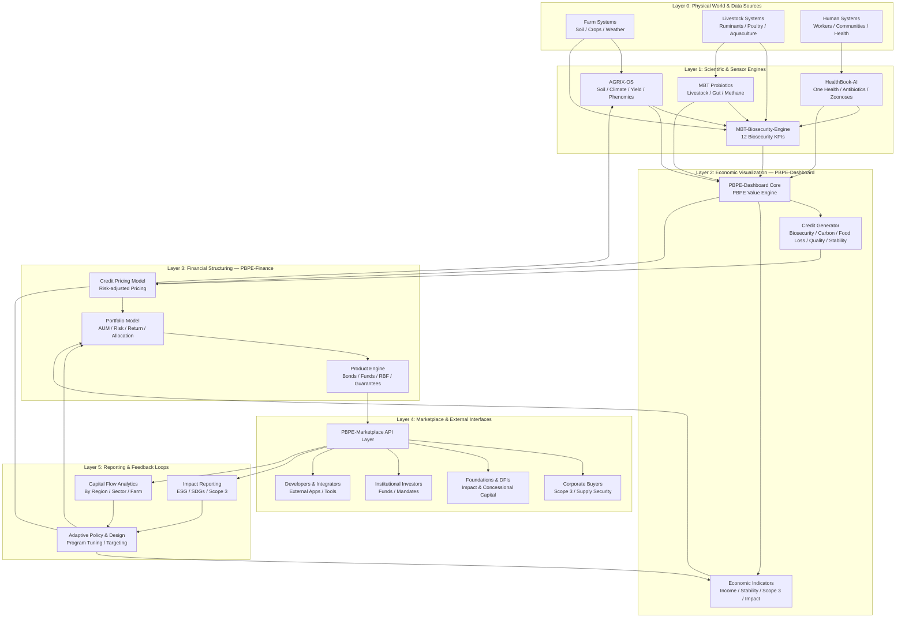

# PBPE OS – System Architecture (English Version)

This document describes the full architecture of the **Planetary Bio-Positive Economy Operating System (PBPE OS)**.  
It shows how scientific models, economic valuation, financial engines, and marketplace APIs integrate into a unified system.

---

## 1. Overview

PBPE OS is a multi-layer operating system that converts **biological improvements** into **economic value**,  
and then into **financial-grade digital assets** (PBPE Credits).

The system consists of four layers:

1. **Layer 1 – Scientific Engine (MBT-Biosecurity-Engine)**  
2. **Layer 2 – Economic Engine (PBPE Planetary Dashboard)**  
3. **Layer 3 – Financial Engine (PBPE Finance Engine)**  
4. **Layer 4 – Marketplace & API Layer (PBPE Marketplace)**

---

## 2. PBPE OS Architecture Diagram (Mermaid)

---

## 3. Layer Descriptions

### **Layer 1 – Scientific Engine (MBT-Biosecurity-Engine)**

The scientific core of PBPE OS.  
It calculates 12 biosecurity KPIs including:

- Disease Loss Reduction
- Yield Gain
- Quality Premium
- Anti-Spoilage
- Food Loss Reduction
- Cost Reduction
- ΔC (Soil Carbon)
- GHG Reduction
- Price Stability
- Biosecurity ROI
- PBPE Biosecurity Value
- Livestock Biosecurity Score

**Output:**  
Structured scientific KPIs → sent to Layer 2.

---

### **Layer 2 – Economic Engine (PBPE Planetary Dashboard)**

Converts scientific KPIs into **economic value**.

- PBPE Value (USD)
- Scope 3 Reduction
- Regional Impact
- Crop/Climate Scenarios
- Multi-region aggregation

**Output:**  
Economic valuation → sent to Layer 3.

---

### **Layer 3 – Financial Engine (PBPE Finance Engine)**

Transforms PBPE Value into **financial-grade digital assets**.

- Credit Pricing
- Risk Adjustment
- Portfolio Modeling
- Financial Products (PBPE Credits, Bundles, Indices)

**Output:**  
Priced credits & financial products → sent to Layer 4.

---

### **Layer 4 – Marketplace & API Layer (PBPE Marketplace)**

The external-facing layer.

- Credits API
- Products API
- Impact API
- Buyer Dashboard
- Corporate Scope 3 Integration

**Output:**  
Tradable PBPE Credits & Products.

---

## 4. Data Flow Summary

1. **Scientific → Economic**  
    MBT55 effects become measurable KPIs → PBPE Value.
    
2. **Economic → Financial**  
    PBPE Value becomes priced credits & financial products.
    
3. **Financial → Marketplace**  
    Credits become tradable assets for companies and buyers.
    

---

## 5. Repository Mapping

|Layer|Repository|Status|
|---|---|---|
|Layer 1|MBT-Biosecurity-Engine|Active / Core|
|Layer 2|PBPE-Dashboard|Under development|
|Layer 3|PBPE-Finance|Under development|
|Layer 4|PBPE-Marketplace|New repository|

---

## 6. Purpose of This Document

This file serves as the **official architecture reference** for PBPE OS.  
It should be updated as new modules, APIs, and dashboards are added.

